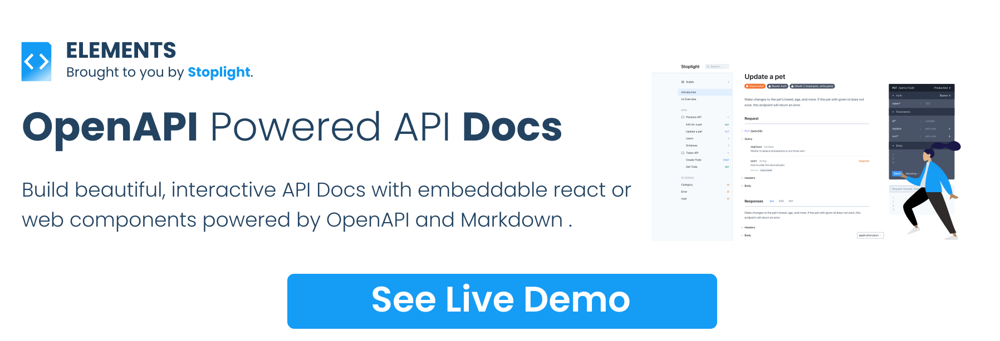

[][elements_landing_page]

[](https://stoplight-elements.netlify.app)
[![CircleCI][circle_ci_image]][circle_ci]
[![NPM Downloads][circle_ci_image]][npm]
[][stoplight_forest]

Beautiful API documentation powered by OpenAPI and Markdown. Use these UI components to create API reference documentation, or more complete documentation with Markdown articles covering tutorials, how-to guides, etc.

Available as React Components, or Web Components, you can use Elements all together to build beautiful three-column "Stripe-esque" documentation, or stacked documentation thats easier for integrating into existing Content Management Systems with their own navigation.

# Overview

- [Overview](#overview)
  - [📖 Community](#-community)
  - [👁️🗨 ️️Examples](#️-️️examples)
  - [🏁 Usage](#-usage)
    - [React Component](#react-component)
    - [Web Component](#web-component)
  - [🚧 Roadmap](#-roadmap)
  - [⚙️ Integrations](#️-integrations)
  - [🏁 Help Others Utilize Elements](#-help-others-utilize-elements)
  - [👏 Contributing](#-contributing)
  - [🎉 Thanks](#-thanks)
  - [🌲 Sponsor Elements by Planting a Tree](#-sponsor-elements-by-planting-a-tree)

## 📖 Community

Let's chat about features, ideas, what you're doing with Elements, on [GitHub Discussions](https://github.com/stoplightio/elements/discussions).

## 👁️🗨 ️️Examples

Stoplight Elements comes with a few example integration projects, showing you how to utilize Elements with different frameworks.
- **[react-cra](./examples/react-cra)** - An example app built using Create React App utilizing Stoplight Elements.
- **[react-gatsby](./examples/react-gatsby)** - An example Gatsby site utilizing Stoplight Elements.
- **[angular](./examples/angular)** - An angular app utilizing the Web Components distribution of Elements.
- **[bootstrap](./examples/bootstrap)** - A single HTML page utilizing the Web Components distribution via a global script tag.

To run these examples yourself:
1. Clone this repo.
2. Go to `examples` folder and open an example, e.g.: `examples/angular`.
3. Run `yarn` to install all dependencies.
4. Run `yarn start` to run the example.

> **Note:** for **bootstrap** example just go straight to its directory and open the HTML file.

## 🏁 Usage

The examples will hopefully help show Elements working in close to real world situations, but the most bare bones examples of Elements can be found below.

### React Component

```bash
$ npm install @stoplight/elements
```

```js
import { API } from "@stoplight/elements";

<API
  apiDescriptionUrl="https://api.apis.guru/v2/specs/github.com/1.1.4/openapi.yaml"
  router="history"
/>
```

For more information on using Elements as a React component, head over to our [React documentation](docs/getting-started/elements/react.md).
### Web Component

```html
<!doctype html>
<html lang="en">
  <head>
    <meta charset="utf-8">
    <meta name="viewport" content="width=device-width, initial-scale=1, shrink-to-fit=no">
    <title>Elements in HTML</title>
    <!-- Embed elements Elements via Web Component -->
    <script src="https://unpkg.com/@stoplight/elements/web-components.min.js"></script>
    <link rel="stylesheet" href="https://unpkg.com/@stoplight/elements/styles.min.css">
  </head>
  <body>

    <elements-api
      apiDescriptionUrl="https://api.apis.guru/v2/specs/github.com/1.1.4/openapi.yaml"
      router="hash"
      layout="sidebar"
    />

  </body>
</html>
```

Load this page up in your browser and you should see the [GitHub REST API](https://docs.github.com/en/rest) documented in Stoplight Elements.

For more information on using Elements as a Web Component, head over to our [Web Component documentation](docs/getting-started/elements/html.md).

## 🚧 Roadmap

- [x] API Console (a.k.a "Try it!")
- [x] Automatic Code Samples
- [x] Automatic Examples
- [x] React & Web Component Support
- [x] OpenAPI Support
  - [x] OpenAPI v3.1
  - [x] OpenAPI v3.0
  - [x] OpenAPI v2.0
- [x] Callbacks
- [x] Webhooks
- [x] Multiple APIs (a.k.a "Dev Portal")

Submit your ideas for new functionality on the [Stoplight Roadmap](https://roadmap.stoplight.io/?utm_source=github&utm_medium=elements&utm_campaign=readme).

## ⚙️ Integrations

- [Stoplight Studio](https://stoplight.io/studio/?utm_source=github.com&utm_medium=referral&utm_campaign=github_repo_elements) - Free visual OpenAPI designer that uses Elements to preview your API descriptions on the fly.
- [Stoplight Platform](https://stoplight.io/?utm_source=github.com&utm_medium=referral&utm_campaign=github_repo_elements) - Collaborative API Design Platform for designing, developing and documenting APIs with hosted documentation powered by Elements.
- [LaravelPHP Elements](https://packagist.org/packages/juststeveking/laravel-stoplight-elements) - A simple API documentation package for Laravel using OpenAPI and Stoplight Elements.

## 🏁 Help Others Utilize Elements

If you're using Elements for an interesting use case, [contact us](mailto:growth@stoplight.io) for a case study. We'll add it to a list here. Spread the goodness 🎉

## 👏 Contributing

If you are interested in contributing to Elements itself, check out our [contributing docs ⇗][contributing] and [code of conduct ⇗][code_of_conduct] to get started.

## 🎉 Thanks

Elements is built on top of lots of excellent packages, and here are a few we'd like to say a special thanks to.

- [httpsnippet](https://www.npmjs.com/package/httpsnippet) by [Kong](https://github.com/Kong).
- [openapi-sampler](https://www.npmjs.com/package/openapi-sampler) by [ReDocly](https://redoc.ly/).

Check these projects out!

## 🌲 Sponsor Elements by Planting a Tree

If you would like to thank us for creating Elements, we ask that you [**buy the world a tree**][stoplight_forest].

[stoplight_forest]: https://ecologi.com/stoplightinc

[code_of_conduct]: CODE_OF_CONDUCT.md
[contributing]: CONTRIBUTING.md
[download-release]: https://github.com/stoplightio/elements/releases/latest
[elements_landing_page]: https://elements-demo.stoplight.io?utm_source=github&utm_medium=elements&utm_campaign=readme
[circle_ci]: https://circleci.com/gh/stoplightio/elements
[circle_ci_image]: https://img.shields.io/circleci/build/github/stoplightio/elements/main
[npm]: https://www.npmjs.com/package/@stoplight/elements
[npm_image]: https://img.shields.io/npm/dw/@stoplight/elements?color=blue
[stoplight_forest]: https://ecologi.com/stoplightinc
