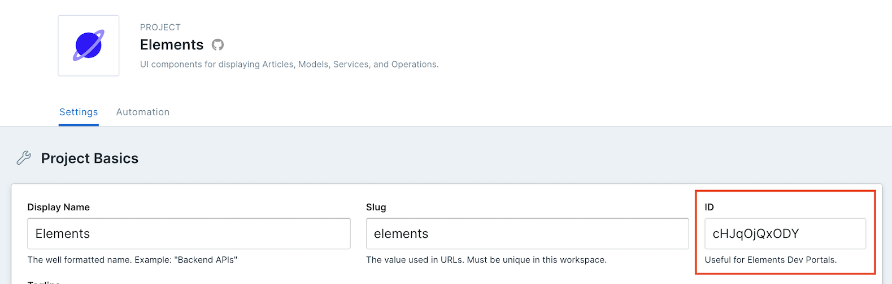

# Elements Dev Portal in React

Learn how to quickly get started with Elements Dev Portal in a React project.

## Create React App Template

We've created a [Create React App template](https://github.com/stoplightio/cra-template-elements-dev-portal), which allows you to create a brand new Elements Dev Portal website in React without any additional setup.

```bash
npx create-react-app my-dir --template @stoplight/elements-dev-portal
```

Then run `cd my-dir` and `yarn start` and you will see a basic Elements Dev Portal website in the browser.

When the server has started, navigate to `http://localhost:3000`. There you will see Elements Dev Portal rendering an [example Git project](https://github.com/stoplightio/studio-demo). Follow the instructions below to change your `projectId` and load up one of your own projects.

## Manual Setup

To install Elements Dev Portal in an existing React app, follow these instructions.

1. Install the [@stoplight/elements-dev-portal](https://www.npmjs.com/package/@stoplight/elements-dev-portal) package with NPM/Yarn.

```bash
yarn add @stoplight/elements-dev-portal
```

2. In `App.js` import the API component and CSS file from the Elements library.

```jsx
import { StoplightProject } from '@stoplight/elements-dev-portal';
import '@stoplight/elements-dev-portal/styles.min.css';
```

3. Find the "Project ID" from the Project Settings view of your Stoplight Project.

> Project Settings can only be viewed by Project Editors or above. Read more about project permissions [here](https://meta.stoplight.io/docs/platform/ZG9jOjg1NjcyNzE-manage-project-access#project-roles).



4. Now you can replace the existing App component's contents with the StoplightProject component.

```jsx
<StoplightProject projectId="cHJqOjYyNTgw" />
```

Now your `App.js` file should look something like this:

<!-- title: App.js -->
```jsx
import React from 'react';

import { StoplightProject } from '@stoplight/elements-dev-portal';
import '@stoplight/elements-dev-portal/styles.min.css';


function App() {
  return (
    <div className="App">
      <StoplightProject projectId="cHJqOjYyNTgw" />
    </div>
  );
}

export default App;
```

## Fire it up

Now start the development server.

```bash
yarn start
```

And you should see the API reference documentation for the Zoom API!

## Configuration

- `projectId` - Find the Project ID in the Project Settings screen on Stoplight.
- `platformUrl` - By default this is `https://stoplight.io/` and this default will be fine for most people. Some enterprise customers might need to change it.
- `basePath` - Helps when using `router: 'history'` but docs are in a subdirectory like `https://example.com/docs/api`.
- `collapseTableOfContents` - Pass `true` to stop the table of contents expanding folders of articles, and showing lists of endpoints for an API. This will clean up the ToC if you have a lot of content.
- `hideMocking` - Pass `true` to disable all mocking options and remove mention of the mock server.
- `hideTryIt` - Pass `true` to hide the "Try It" panel (the interactive API console).
- `router` -  Determines how navigation should work:
  - `history` - (default) uses the HTML5 history API to keep the UI in sync with the URL.
  - `hash` - uses the hash portion of the URL (i.e. window.location.hash) to keep the UI in sync with the URL.
  - `memory` - keeps the history of your "URL" in memory (does not read or write to the address bar).
