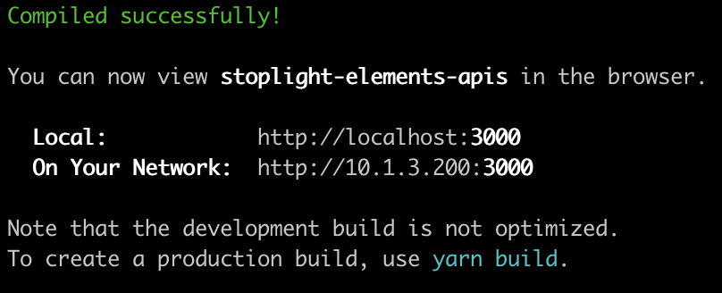
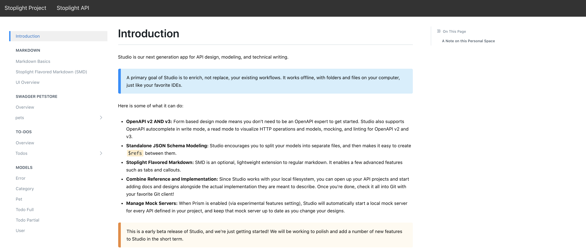
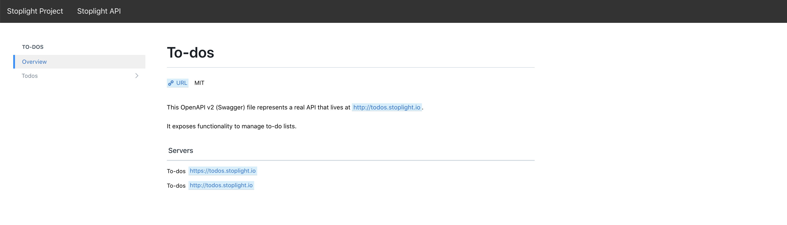

# Stoplight Elements - React App Example

## Table Of Contents

* [Overview](#overview)
  * [Stoplight Project](#stoplight-project)
  * [Stoplight API](#stoplight-api)
* [Trying the example](#trying-the-example)
  * [Installation](#installation)
  * [Usage](#usage)
  * [Functionalities](#functionalities)
* ['Elements' in your own React App](#elements-in-your-own-react-app)
  * [Step 1 - Install stoplight-elements](#step-1-install-elements)
  * [Step 2 - Embed Elements](#embed-elements)

## Overview

Stoplight Elements can be embedded natively in React app. This example demonstrates usage of Stoplight Project and Stoplight API components and presents how to embed Elements in your own application.

### Stoplight Project

This component allows embedding documentation that is connected to a Stoplight workspace. In this example, we are referring to [elements.stoplight.io](https://elements.stoplight.io) workspace - [studio-demo](https://elements.stoplight.io/docs/studio-demo) project to be more precise.

### Stoplight API

Stoplight API component allows embedding documentation with no limitations to the file localization - it can be either on your webpage/app server or anywhere on the web. In this example, we connect the `Stoplight API` directly to [To-Dos](https://raw.githubusercontent.com/stoplightio/studio-demo/master/reference/todos/openapi.v1.json) OAS2 .JSON file hosted on GitHub.

## Trying the example

### Installation

Clone the [@stoplight/elements](https://github.com/stoplightio/elements/tree/beta/) repo and check out the `beta` branch if you haven't already.

```bash
git clone https://github.com/stoplightio/elements.git

cd elements

git checkout beta
```

Visit the *react-app* folder under *examples*, and install dependencies using `yarn`.

```bash
cd examples/react-app

yarn
```

If the above was successful, launch the example project using `yarn start`.



Now if you open your browser and navigate to http://localhost:300/ as instructed, you will see a React App that contains both Stoplight Project and Stoplight API components embedded in it.

### Usage

#### **Stoplight Project**

Click on the `Stoplight Project` button in the topbar menu to see that component in action:



#### **Stoplight API**

Click on the `Stoplight API` button in the topbar menu to see that component in action:



### **Functionalities**

* Navigate to Markdown section in order to see our beautiful Markdown Viewer in action

* Open any of the models to take a look at JSON Schema Viewer (JSV)

* View basic information about a given API in `Overview` section

* Open API endpoints to preview their properties and try out Http Request Maker

## Elements in your own React App

### Step 1 - Install Elements

In order to use Elements in React, we need to use the [@stoplight/elements](https://www.npmjs.com/package/@stoplight/elements) package from NPM. Let's add it:

```bash
# in case you use NPM
npm install @stoplight/elements
# in case you use Yarn
yarn add @stoplight/elements
```

### Step 2 - Embed Elements

This step describes embedding Elements component in a single-page React App

1. Create a React component e.g. components/API.*
   * Import desired component from `@stoplight/elements`
   * Import styles from `@stoplight/elements/styles/elements.scss`
   * Create React Functional Component

For `Stoplight API` you need to add `apiDescriptionUrl` property

```tsx
import React from 'react';
import { API } from '@stoplight/elements';
import '@stoplight/elements/styles/elements.scss';

export const StoplightAPI: React.FC = () => {
  return (
    <API apiDescriptionUrl="$YOUR-FILE-URL"></API>
  );
};
```

For `Stoplight Project` you need `workspace` and `project` properties

```tsx
import React from 'react';
import { StoplightProject } from '@stoplight/elements';
import '@stoplight/elements/styles/elements.scss';

export const StoplightProjectDocs: React.FC = () => {
  return (
    <div>
      <StoplightProject workspace="$STOPLIGHT-WORKSPACE-URL" project="#PROJECT-SLUG"></StoplightProject>
    </div>
  );
};
```

2. Import and add created component to your `App.` file:

```tsx
import React, { Component } from 'react';

import { StoplightAPI } from './components/API';

class App extends Component {
  render() {
    return <StoplightAPI></StoplightAPI>;
  }
}

export default App;

```

3. Add Font Awesome to `index.html`

```html
    <script src="https://kit.fontawesome.com/353fd702c1.js" crossOrigin="anonymous"></script>
```

### Step 3 - open your app

At this step you are ready to open your app and see the embedded Elements component. Enjoy!

Check out the Elements documentation for more details: [@stoplight-elements](https://www.npmjs.com/package/@stoplight/elements)